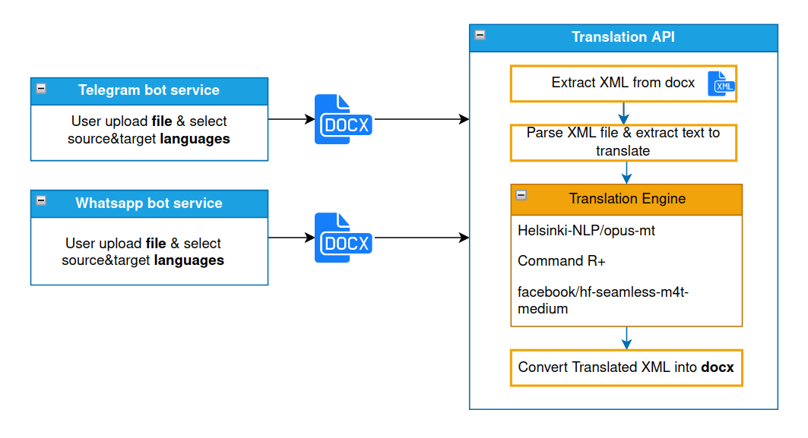

# Document Translator Service

This service was developed to translate documents without breaking their structure. Below is an overview of the service architecture.



## Available Features
- **Translation API Service**: A dedicated API service for translating documents.
- **Telegram Bot**: A chatbot interface for document translation via Telegram.

## Supported Languages:
* Ukrainian
* German
* English

## Supported Models
- **[Helsinki-NLP/opus-mt](https://huggingface.co/Helsinki-NLP)**: A collection of translation models for many language pairs.
- **[facebook/hf-seamless-m4t-medium](https://huggingface.co/facebook/hf-seamless-m4t-medium)**: A multilingual and multitask model for translation, transcription, and text generation.
- **[Cohere LLM (Command R+)](https://docs.cohere.com/docs/cohere-command)**: A large language model for a variety of NLP tasks.
- **Deployed [Mistral-Nemo-Instruct-2407](https://huggingface.co/mistralai/Mistral-Nemo-Instruct-2407)**: A model deployed for specific translation and instruction-based tasks.

## Local Setup

### Running the Entire Service (with All Components)

To run the entire service, including both the translation API and the Telegram bot:

```sh
docker-compose up --build
```

### Running Only the Translation API

If you want to build and run only the Translation API service:

```sh
docker-compose up --build translator_backend
```
#### Usage

After starting the Translation API, it will be available at http://localhost:8000. You can interact with the API via HTTP requests. Here’s an example of how to translate a document:

```sh
curl -X POST "http://localhost:8000/translate_document?src_lang=ukrainian&tgt_lang=english&output_format=docx" \
-H "accept: application/json" \
-H "Content-Type: multipart/form-data" \
-F "file=@/path/to/your/document.docx"
```
** <i>Replace <b>/path/to/your/document.docx</b> with the path to the document you want to translate.</i>

## Prerequisites

Ensure you have the following installed on your local machine:

* Docker
* Docker Compose

## License

This project is licensed under the MIT License - see the [LICENSE](LICENSE.md) file for details.